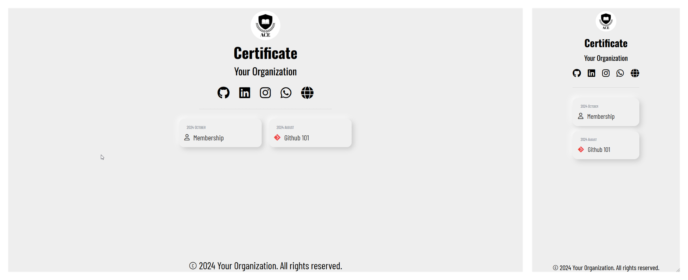
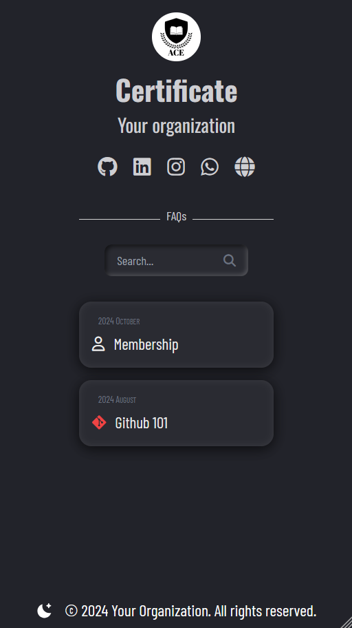
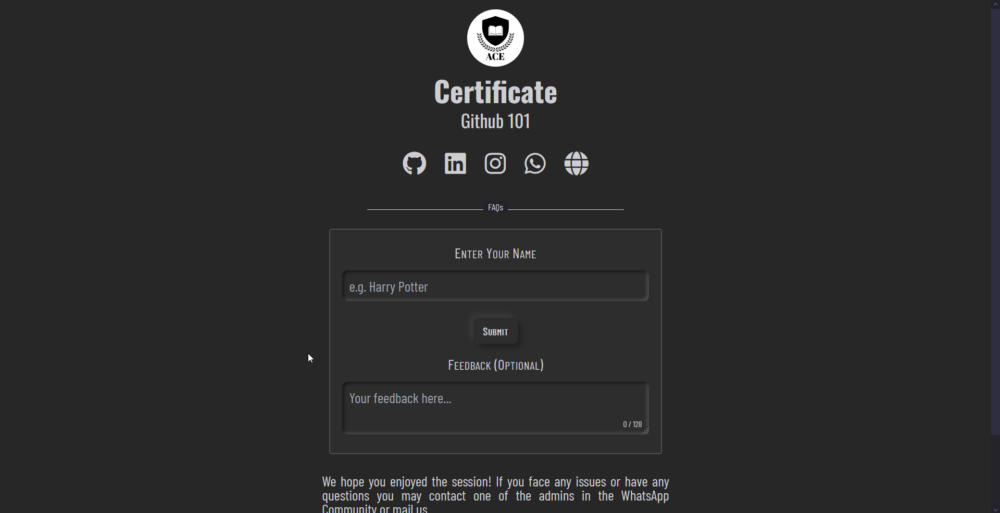
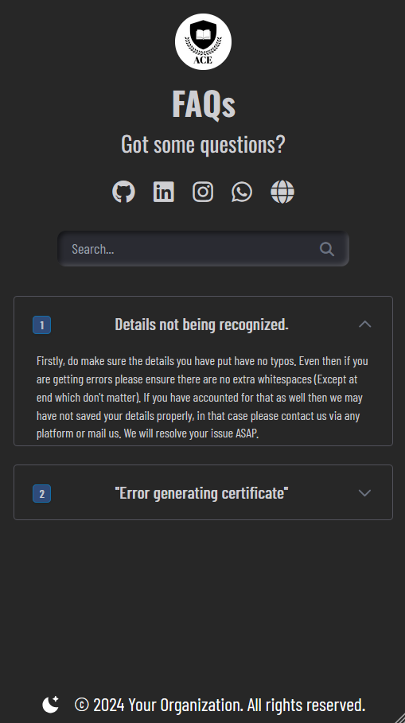
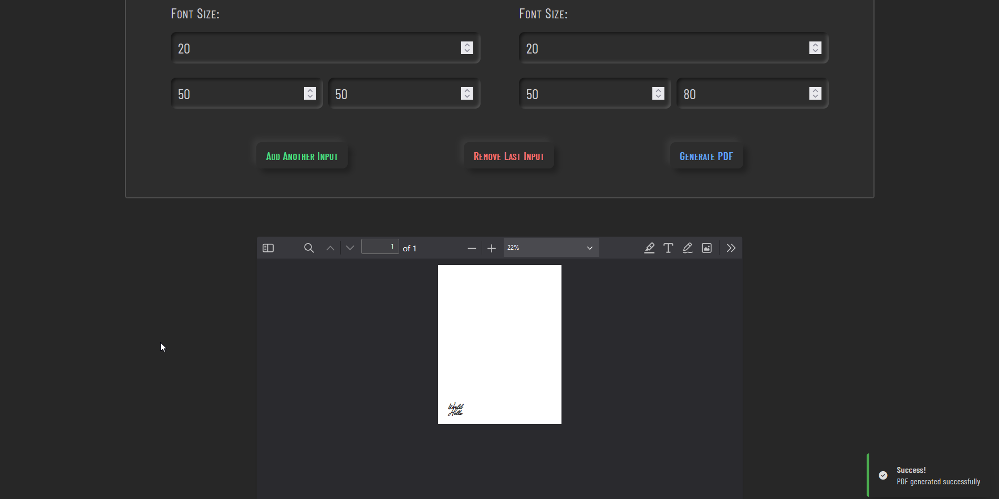

# Event Certificate Website

A certificate website with ability to hand out multiple certificate in PDF Format for various events. It has a nice, minimal and interactive UI which is responsive for small as well as large screens. Built using Node/Express and MongoDB it allows for multiple template, multiple schemas/models and a central CSV processor alongside indiviual ones. At a glance the app consists of

- **Node/Express** Backend with main entry via `app.js` into `gateway.ejs`.
- Specific datasets in `Datasets/` which are uploaded via files in `CSV_Handlers`. Includes a centralized CSV Processor.
- Many templates which are programatically written to via **`pdflib`** allowing for OpenType fonts and high customization.
- Tests written in **Jest** to streamline the process.
- A minimal and responsive UI which can be easily modified as per liking. Uses **Tailwind CSS** and has dark mode.
- Scalable for large datasets with good error handling and easy to modify.
- Allows you to test out placement of text on any PDF via `try-pdf.ejs`. Includes setting font size and font family.
- Features a great, minimal and stacking toast functionality with various types as per requirements
- A feedback optionality in the forms. A dedicated FAQs page and redirects in case of errors. Loading indicator during page load

## In Future

- [X] Make a more or less centralized CSV Processor
- [X] Implement dark mode
- [X] Make a new route for testing out text on PDF
- [ ] Write more tests
- [X] Feedback system (Will expand on this)
- [X] FAQs and better error page (Partially)
- [X] Loading indicator
- [ ] Add an analytics page based on feedback, can see event-wise

## Setup

1. Firstly make a MongoDB Atlas account and connect to it. (Preferably by VSCode Extension)
2. Put your connection string in `.env.local` file.
3. Install necessary packages via `npm i`.
4. Test out the existing events by uploading `node ...js` (For using `csvProcessor` make proper file like `membershipProcessor`) which will upload the data into your MongoDB collections. Then run `nodemon app.js` to start the app.
5. If it throws error then check firstly it says `Connected to MongoDB` in console, if not then connect to. (Usually by whitelisting your IP)
6. Open `localhost:3000` and then try it out. On `/` you will see links to the other events.
7. Deployable if you wish. (Check `.github/`)
8. If you wish to use `try-pdf.ejs` then run `node generate.js`.

## Notes

- See LICENSE.
- I have put `generate.js` to run on separately from `app.js` with regards to production.
- The basic idea is you have your events and workshops and what-not. The website helps you to give away certificates, you store the user data in CSV for people who attended them and upload it to MongoDB. The user has to visit the website and go to the respective event page then they put in their name and other details and simply get the certificate. The PDF generates in real time, not need to generate them beforehand (You will have to provide template in `Certificate_Templates` and CSV files goes in `CSV_Handlers`) 
<!-- - This is not a CMS, you have to code in your own pages for each event and all other things.  -->

### More Images

