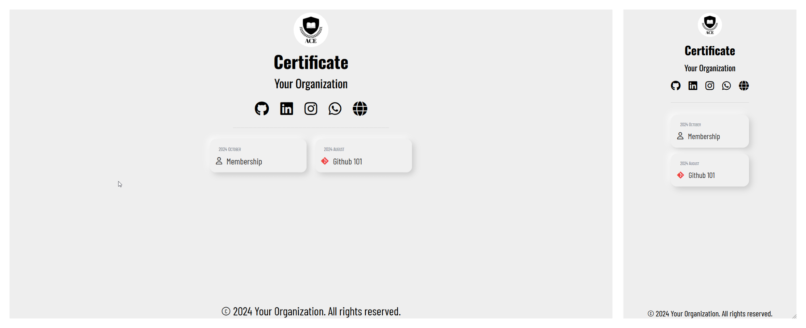

# Event Certificate Website

A certificate website with ability to hand out multiple certificate in PDF Format for various events. It has a nice, minimal and interactive UI which is responsive for small as well as large screens. Built using Node/Express and MongoDB it allows for multiple template, multiple schemas/models and a central CSV processor alongside indiviual ones. At a glance the app consists of

- **Node/Express** Backend with main entry via `app.js` into `gateway.ejs`.
- Specific datasets in `Datasets/` which are uploaded via files in `CSV_Handlers`. Includes a centralized CSV Processor.
- Many templates which are programatically written to via **`pdflib`** allowing for OpenType fonts and high customization.
- Tests written in **Jest** to streamline the process.
- A minimal and responsive UI which can be easily modified as per liking. Uses **Tailwind CSS** and has dark mode.
- Scalable for large datasets with good error handling and easy to modify.

## In Future

- ~~Make a more or less centralized CSV Processor~~
- ~~Implement dark mode~~

# Setup

1. Firstly make a MongoDB Atlas account and connect to it (Preferably by VSCode Extension)
2. Put your connection string in `.env` file.
3. Install necessary packages via `npm i`.
4. Test out the existing events by uploading `node ...js` (For using `csvProcessor` make proper file like `membershipProcessor`) which will upload the data into your MongoDB collections. Then run `nodemon app.js` to start the app.
5. If it throws error then check firstly it says `Connected to MongoDB` in console, if not then connect to. (Usually by whitelisting your IP)
6. Open `localhost:3000` and then try it out. On `/` you will see links to the other events.
7. Deployable if you wish (Check `.github/`)

### Notes

See LICENSE.